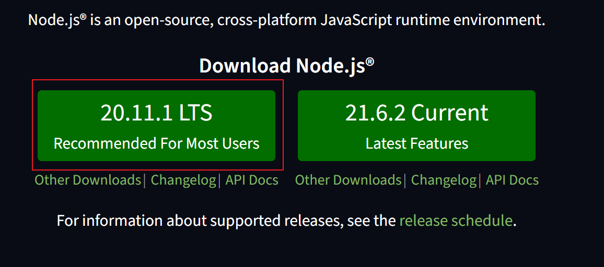
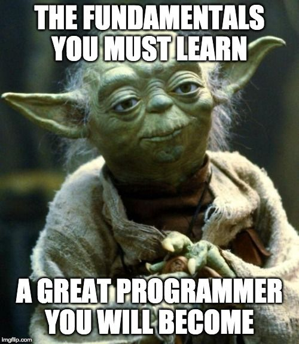

# Day 1


## Modern JavaScript


## Preliminary


Beware of [JavaScript Fatigue](https://www.freecodecamp.org/news/the-cure-to-js-fatigue/)


### Web Programmer's Oath


I will always have my browser's developer console open.


I will progress in small steps

>The only way to go fast, is to go well.
>
>                  -- Robert Martin (Uncle Bob)
<!-- .element: class="fragment" data-fragment-index="1" -->

>A little bit of code and test.
>
>                       -- John Misirlakis
<!-- .element: class="fragment" data-fragment-index="2" -->


I will write LOTS of `console.log` statements


I will NOT write more code, if my code doesn't work. Instead I delete code until it works again.


>10% of programming is knowing what code to write. The other 90% is being able to figure out why the code you wrote isn't working!
>
>                               -- Tyler Maxwell
<!-- .element: class="fragment" data-fragment-index="1" -->


### What is JavaScript???


[Interpreted](https://login.codingdojo.com/m/754/16712/124457#:~:text=Features-,Interpreted,-JavaScript%20is%20an) 

[interpreter???](https://v8.dev/docs)
<!-- .element: class="fragment" data-fragment-index="1" -->

[open source](https://github.com/v8)
<!-- .element: class="fragment" data-fragment-index="2" -->


[Event-driven](https://login.codingdojo.com/m/754/16712/124457#:~:text=most%20popular%20browsers%3A-,Event%2Ddriven,-JavaScript%20is%20an) 

<button onclick="myFunc()">click me</button>
<!-- .element: class="fragment" data-fragment-index="1" -->


[Single-threaded](https://login.codingdojo.com/m/754/16712/124457#:~:text=and%20work%20together!-,Single%2Dthreaded,-JavaScript%20is%20run) 


<!-- .element: class="fragment" data-fragment-index="3" -->


### Full Stack JavaScript


<a href="https://nodejs.org/en" target="_blank">Installation</a>





## Fundamentals





### Variables


```javascript
var name = "Tyler"
```


```javascript
let name = "Tyler"
const FIRST_NAME = "Tyler"
```


How do you know when to use `let` or `const`?

Use `const` unless you have to use `let`!
<!-- .element: class="fragment"  -->


## Variable Scope


local or global


```javascript

let global = "I'm global!"

const func = () => {
    let local = "I'm local!"
}

```
If it's not in a function, it's global!!
<!-- .element: class="fragment"  -->

[demo](https://github.com/tmax818/mern_march24/blob/main/lectures/01day/app.js)


