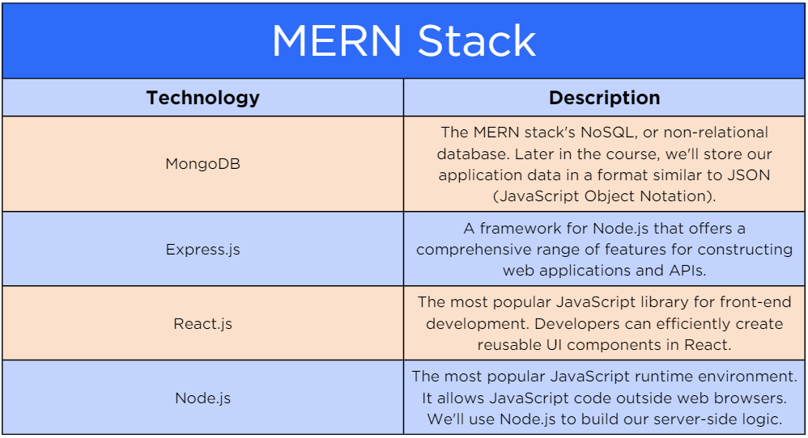

# Day 1

## Modern JavaScript

### What is JavaScript???

[Interpreted](https://login.codingdojo.com/m/754/16712/124457#:~:text=Features-,Interpreted,-JavaScript%20is%20an) 

[interpreter???](https://v8.dev/docs)
<!-- .element: class="fragment" data-fragment-index="1" -->

[open source](https://github.com/v8)
<!-- .element: class="fragment" data-fragment-index="2" -->

[Event-driven](https://login.codingdojo.com/m/754/16712/124457#:~:text=most%20popular%20browsers%3A-,Event%2Ddriven,-JavaScript%20is%20an) 

<button onclick="myFunc()">click me</button>
<!-- .element: class="fragment" data-fragment-index="1" -->

[Single-threaded](https://login.codingdojo.com/m/754/16712/124457#:~:text=and%20work%20together!-,Single%2Dthreaded,-JavaScript%20is%20run) 

<!-- .element: class="fragment" data-fragment-index="3" -->

### Full Stack JavaScript

<a href="https://nodejs.org/en" target="_blank">Installation</a>

