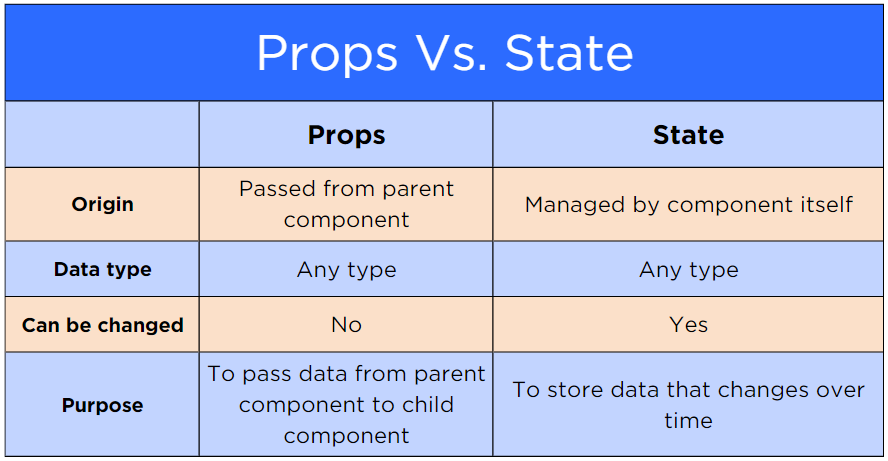

# Day 3


## Functional Components


## What is a component?


```javascript
const App = () => {
  return (
    <>
        // jsx and/or other components here
    </>
  )
}
export default App;
```


## Props


```javascript
const Header = (parameters) => {
  return (
       // whatever we want to return... 
  )
}
```


```javascript
const Header = (props = {}) => {
  return (
       // whatever we want to return... 
  )
}
```


```javascript
const Header = (props) => {
  return (
      <>
      // our jsx here
      </> 
  )
}
```


```html
<Header name="Dennis" >
```

```javascript
Header({name: "Dennis"})
```
<!-- .element: class="fragment" data-fragment-index="1" -->

[props-demo](https://github.com/tmax818/mern_march24/tree/main/lectures/03day/demos/props-demo)


## Events


## hooks


## State


state = data


>State is where we store data that changes over time.


>When state changes, The component rerenders!!!


```javascript
import {useState} from 'react';

const Comp = () => {
  const [state setState] = useState()
}
```


## Props vs State


