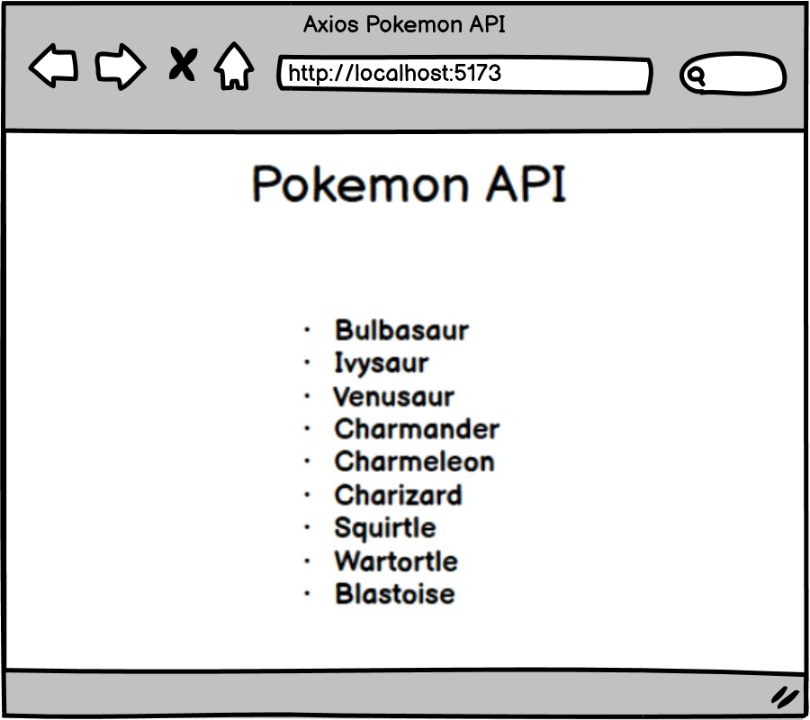

# [Axios Pokemon API(Core)](https://login.codingdojo.com/m/754/16730/124655)

## Learning Objectives
Build with axios and useEffect to create the example wireframe.

## Steps

- [ ] Create a React application and install Axios
- [ ] Fetch and output the names of the first 151 Pokemon immediately when the page renders