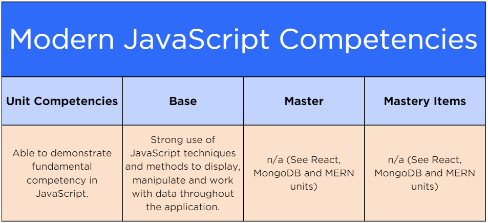

# [Exam Overview: Modern JavaScript](https://login.codingdojo.com/m/754/16713/124460)

## Learning Objectives
- Explain the exam requirements and scoring criteria as they relate to the entire course.
- Analyze the Modern JavaScript unit, its competency area, and the exam requirements related to that criteria.

## The First of Five

### two levels of competency:

- A __base proficiency__ level of competency
- A more advanced __mastery level__ of competency.

>There are _five_ competency areas from these three units with a mastery level— two in __React.js__, one in __MongoDB__, and two in __MERN__.

>The Modern JavaScript Unit does not have any master competencies or goals ...