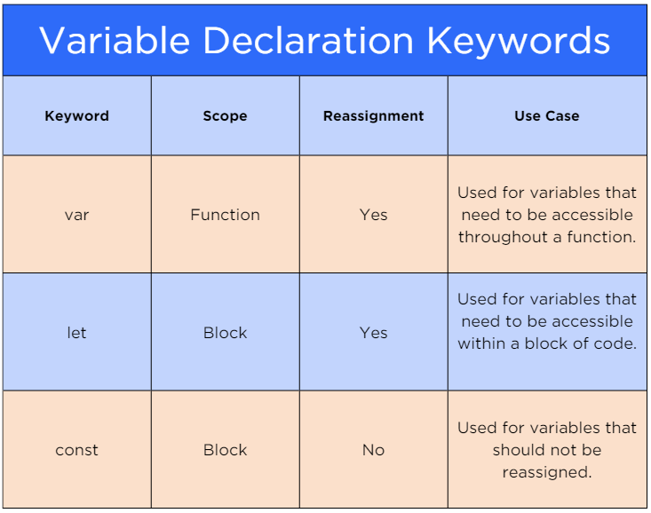

# [Modern JavaScript](https://login.codingdojo.com/m/754/16713/124463)

## Learning Objectives

- Apply the concepts of Modern JavaScript syntax, such as using [`const`] and [`let`] instead of [`var`], to declare variables with specific _scopes_ and _reassignment restrictions_.
- Apply _object destructuring_ to extract properties from object literals and assign them to variables in Modern JavaScript.
- Differentiate between _JavaScript_ and _ECMAScript_, understanding that ECMAScript serves as the standardization of JavaScript.

## A Syntax Overhaul

>The JavaScript language has standards that are maintained by the [European Computer Manufacturer’s Association (ECMA)]. For that reason, we'll see JavaScript referred to as ECMAScript at times. 

## First, Let's Refresh

### Variables

#### [`var`]
#### [`let`]
#### [`const`]

### [Object]s

### [Array]s

## Enter ECMAScript

>ECMAScript is the standardization of JavaScript, and [JavaScript] is the implementation of the ECMA Standard. As mentioned, most of the JavaScript you’ve been exposed to is a version of the standard called ES5, standardized in 2009 and sometimes called ECMAScript 5.

## ES6 and Beyond

>Although other smaller, less consequential updates to the language have happened since, ECMAScript 6, ES2015, or [ES6], is the standard or baseline for modern JavaScript. It is a superset of ES5, meaning it contains all the features of ES5, plus all the new additions of ES6.

>[`var`] has been mostly replaced by [`const`] and [`let`]

>[`let`] and [`const`] provide users with greater control over their variables. Rather than allowing the variable to be reassigned throughout the entire function, as is the case with [`var`], [`let`] and [`const`] are only available to the block of code in which they are written. 

## Object [Destructuring]

>Destructuring is a technique that allows us to extract data from arrays and objects quickly.

---

[European Computer Manufacturer’s Association (ECMA)]: https://ecma-international.org/
[ECMAScript]: https://en.wikipedia.org/wiki/ECMAScript
[JavaScript]: https://en.wikipedia.org/wiki/JavaScript
[ES6]: https://www.w3schools.com/js/js_es6.asp
[`const`]: https://developer.mozilla.org/en-US/docs/Web/JavaScript/Reference/Statements/const
[`let`]: https://developer.mozilla.org/en-US/docs/Web/JavaScript/Reference/Statements/let
[`var`]: https://developer.mozilla.org/en-US/docs/Web/JavaScript/Reference/Statements/var
[Array]: https://developer.mozilla.org/en-US/docs/Web/JavaScript/Reference/Global_Objects/Array
[Function]: https://developer.mozilla.org/en-US/docs/Web/JavaScript/Reference/Global_Objects/Function
[Object]: https://developer.mozilla.org/en-US/docs/Web/JavaScript/Reference/Global_Objects/Object
[Destructuring]: https://developer.mozilla.org/en-US/docs/Web/JavaScript/Reference/Operators/Destructuring_assignment
