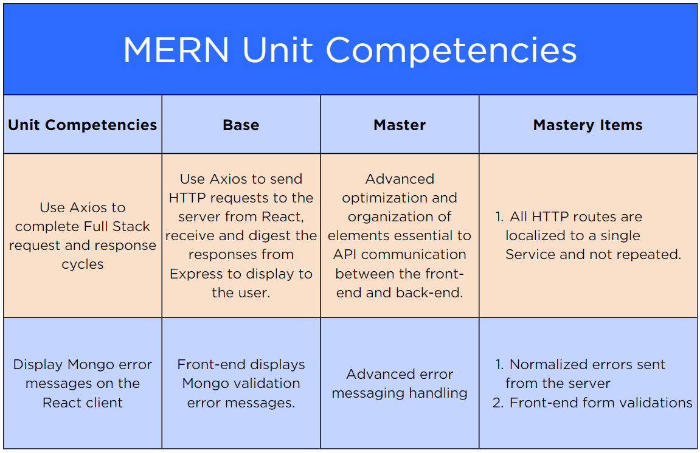

# [Exam Overview: MERN](https://login.codingdojo.com/m/754/16742/124761)

## Learning Objectives

- Explain the exam requirements and scoring criteria as they relate to the entire course
- Analyze the MERN unit, its two competency areas and the exam requirements related to those two criteria.
- Contrast the Proficiency/Red Belt against the Mastery/Black Belt Exam competencies and requirements

## The Fifth of Five

