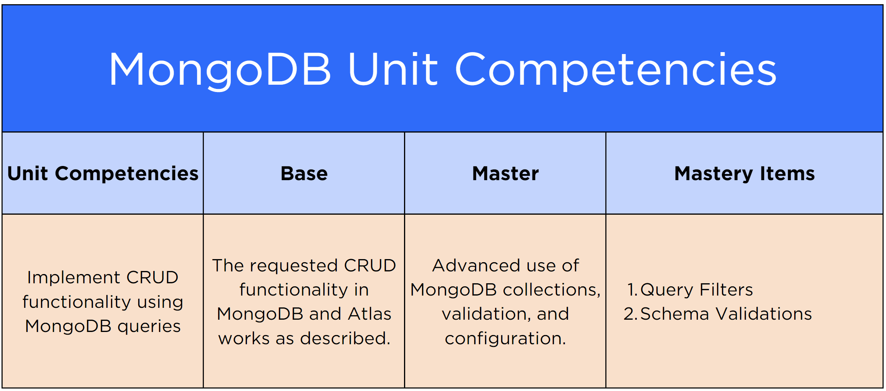

# [Exam Overview: MongoDB](https://login.codingdojo.com/m/754/16738/124729)

## Learning Objectives

- Explain the exam requirements and scoring criteria as they relate to the entire course
- Analyze the MongoDB unit, its competency areas, and the exam requirements related to those criteria
- Contrast the Proficiency/Red Belt against the Mastery/Black Belt Exam competencies and requirements

## The Fourth of Five

