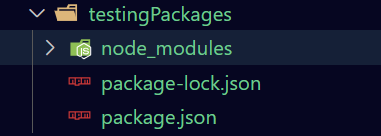
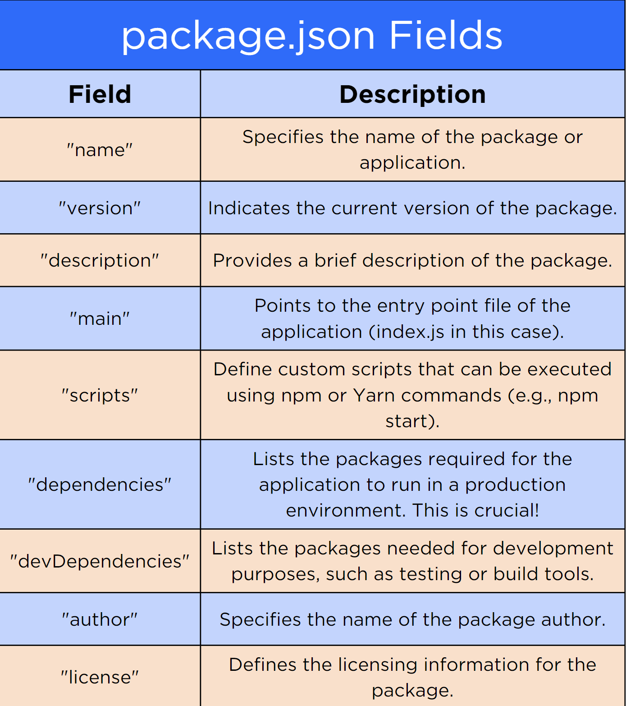

# [Node Package Manager](https://login.codingdojo.com/m/754/16715/124481)

## Learning Objectives
- Manipulate JavaScript libraries using npm
- Interpret and modify the package.json file for application configuration
- Explain how [npmjs.com](https://www.npmjs.com/) can be used to explore and evaluate node_modules

>npm, or Node Package Manager, is a tool used for managing JavaScript libraries.

>When using npm __we always want designated project folders for each project that we build.__ Every assignment will get its own __project folder.__


```bash
$ mkdir testingPackages  # make a new directory
$ cd testingPackages    # change directory(cd) into the directory
$ npm i express     # telling npm to install a single package called express
```



- [node_modules]()
- [package-lock.json](./testingPackages/package-lock.json)
- [package.json](./testingPackages/package.json)



