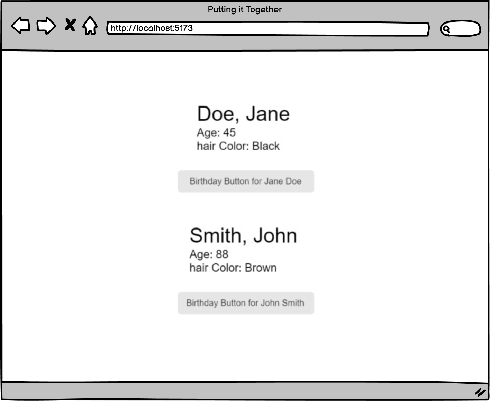

# [Putting it Together(Core)](https://login.codingdojo.com/m/754/16723/124590)

## Learning Objectives

- Analyze and explain the reasons behind the output of code blocks using ES6 syntax, including the application of destructuring, scope, and the spread operator.
- Evaluate potential problems in code blocks and propose appropriate solutions related to ES6 concepts such as destructuring, scope, and the spread operator.

before you begin this assignment, it's important that you've first:

- Completed the preceding lesson modules
- Taken the knowledge checks to confirm your understanding
- Viewed lecture material related to the assignment topics
- Completed and submitted your practice assignments

## Putting it Together:

## Steps

- [ ] Create a state variable for age of the person, with the initial value passed in via props
- [ ] Create a button that increases the person's age by 1 year each time it is clicked
- [ ] Display the current value of age from state (not the original value from the props object)