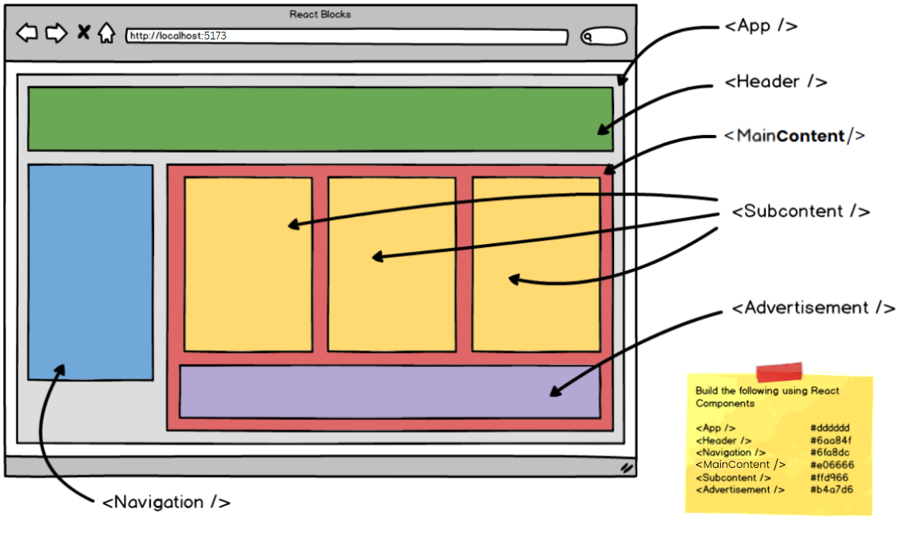

# [React Blocks (Core)](https://login.codingdojo.com/m/754/16723/124562)

## Learning Objectives

- Create functional components with a hierarchical structure

## React Blocks

>Using what you've learned about functional components, recreate the famous ["Plotting your Blocks"](https://login.codingdojo.com/m/201/7502/53343) assignment from Web Fundamentals this time using React Components.

