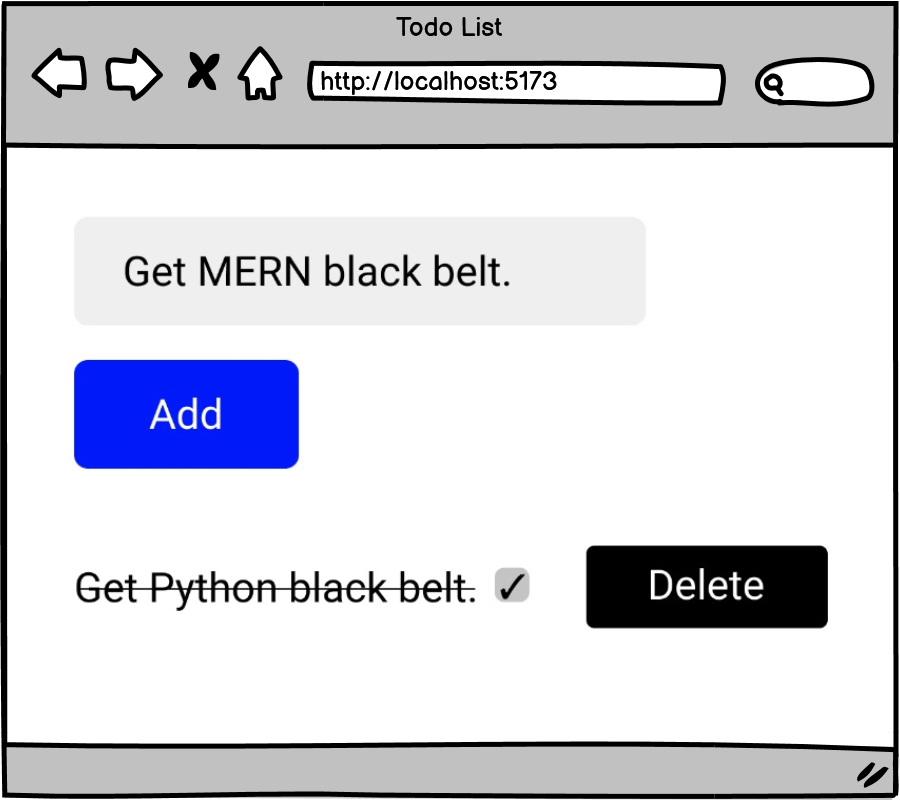

# todo-list
# [Todo List (Core)](https://login.codingdojo.com/m/754/16723/124627)

## Learning Objectives

- Demonstrate proficiency in React concepts such as props, state, lifted state, component hierarchy, map and filter.

## Todo List

-Each task will have a text string as well as a completed property, which will be set to false initially. 

- As you check off items, they should appear slashed out on the page. 

- render a list of items, and give the user the option to remove each item and add new ones. 
 
 
There are different ways to implement the remove function. One way to do it is using the built-in filter method​. Filter returns a new array when invoked and is a great way to stay true to the functional nature of React.

Hint: When calling setState, make sure to send in a brand new object or array.

Your component structure should include __at least three components__ with a state holding the array of "todo" items lifted to the common parent component.

## Steps

- [ ] Iterate through the existing tasks using the map method.

- [ ] Allow the user to add a new task, initially set to not completed. (Hint: The task should be added to the array as one field in an object.)

- [ ] The completion value should be a property in the new task object - not a standalone stateful value

- [ ] Allow the user to remove a task by clicking the delete button.

- [ ] Allow the user to toggle a task's completion property by clicking the checkbox next to it.

- [ ] When updating the tasks' state, don't mutate the current task objects or the current task list. (Hint: Use map to selectively return copies of array elements)

