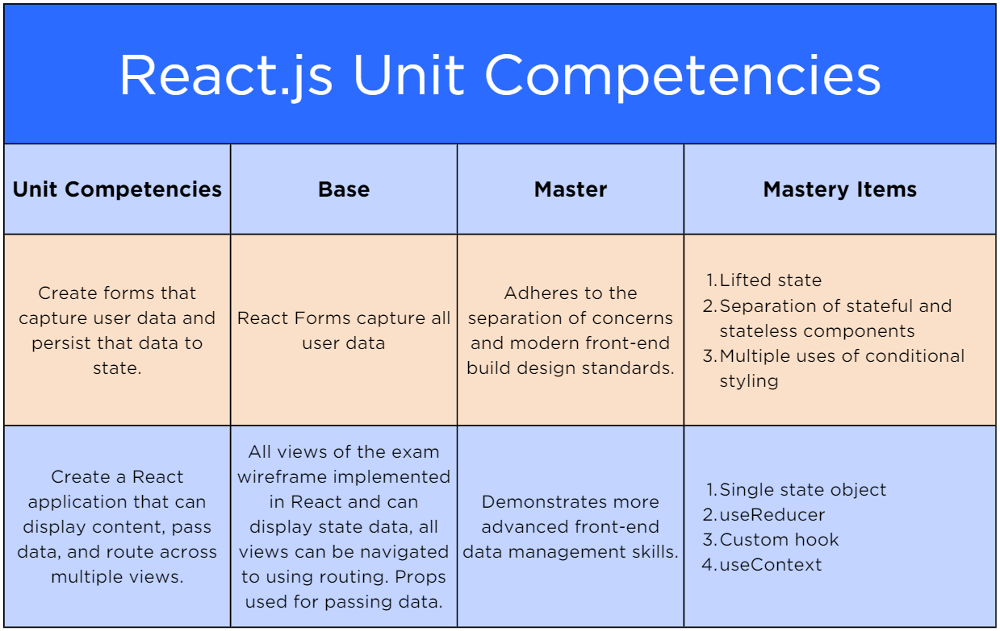

# [	Exam Overview: React](https://login.codingdojo.com/m/754/16722/124547)

## Learning Objectives
- Explain the exam requirements and scoring criteria as they relate to the entire course
- Analyze the React unit, its competency areas, and the exam requirements related to those criteria
- Contrast the Proficiency/Red Belt against the Mastery/Black Belt Exam competencies and requirements

## The Second of Five

