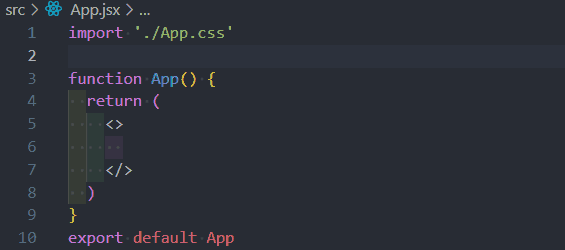

# [Functional Components](https://login.codingdojo.com/m/754/16723/124560)

## Learning Objectives

- Differentiate vanilla functions and React's functional components
- Apply JSX syntax to render content within functional components in React interfaces dynamically

## Abstractions

## Function Vs. Functional Component

## Children Components

>To begin, let’s make a new functional component by creating a components folder within the src folder in our React application and naming it [Header.jsx](./functional-components/src/components/Header.jsx). From here on, the components folder will be a standard within all of our React applications.

## A Deeper Dive: Styling
