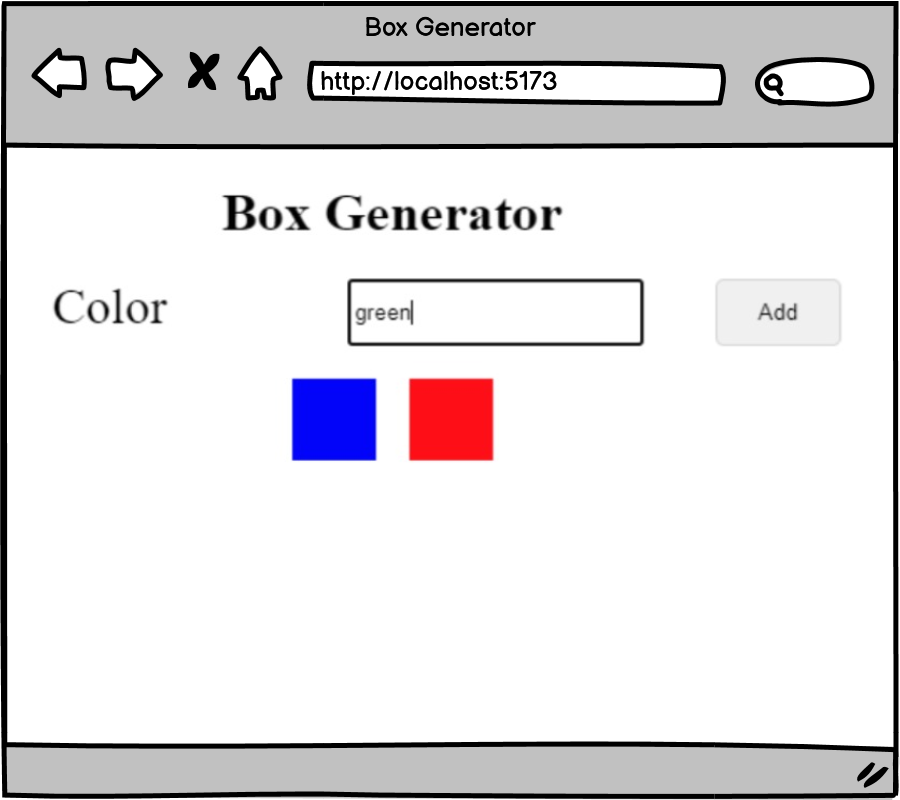
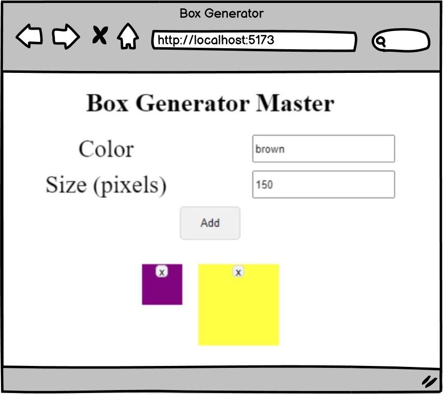

# [Box Generator (Practice)](https://login.codingdojo.com/m/754/16723/124613)

## Learning Objectives

- Demonstrate a comprehension of the similarities and differences between JavaScript functions written in different syntax.
- Implement arrow functions to adhere to modern JavaScript standards and improve code readability.

## Box Generator:

## Ninja Requirements:

## Steps

- [ ] Allow the user to create/add boxes of various colors.
- [ ] On successfully adding a new box, have it appear in the set immediately.
- [ ] Clear out the color input on successful submission.
- [ ] Ninja Bonus: Implement a lifted state design with state data accessible to one child component for the form and another for displaying the box list.
- [ ] Ninja Bonus: Add a second input that takes in an integer. This integer will allow the user to specify the height and width of the generated box.
- [ ] Ninja Bonus: Add a button to delete a box.