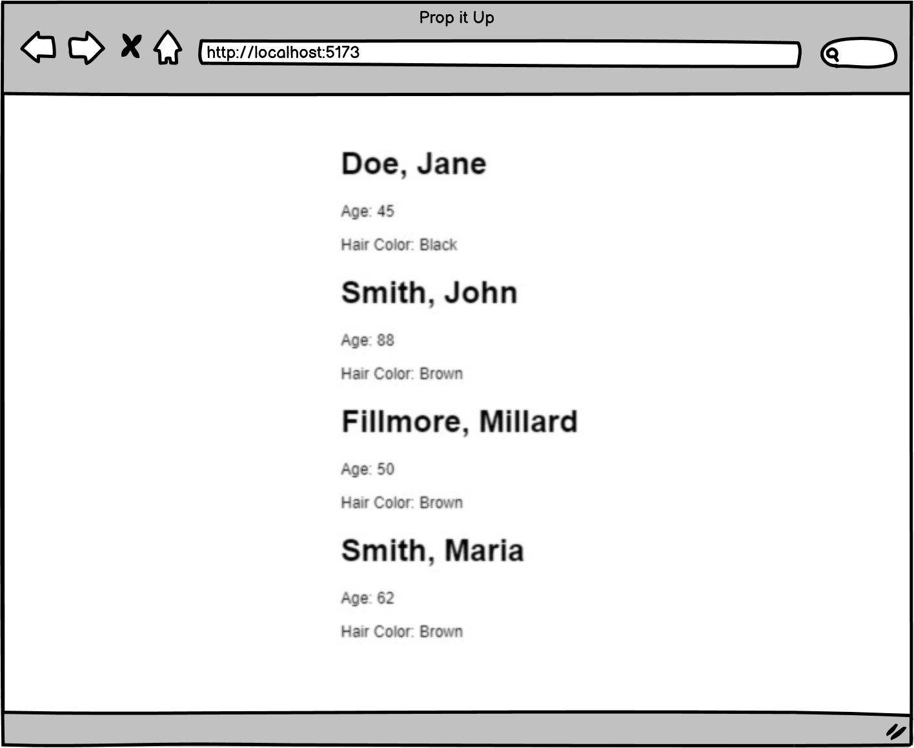

# [Prop It Up(Practice)](https://login.codingdojo.com/m/754/16723/124576)

## Learning Objectives

- Create an interface utilizing props to pass different data to each of the invoked child components

## Steps

- [ ] Create a new component called PersonCard to display a single person's set of information using props for values

- [ ] Call the PersonCard component repeatedly using different prop values to display 4 unique sets of information