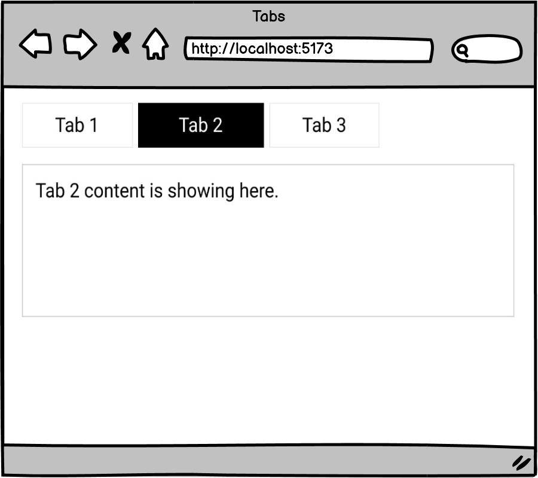

# [Tabs (Practice)](https://login.codingdojo.com/m/754/16723/124643)

## Learning Objectives

- Utilize __conditional rendering__ props and state to update the UI whenever the user clicks a tab.

## Steps

- [ ] Create a tabs component that accepts an array of varying length.

- [ ] Have the tab headers, when clicked on correctly show the appropriate content below.