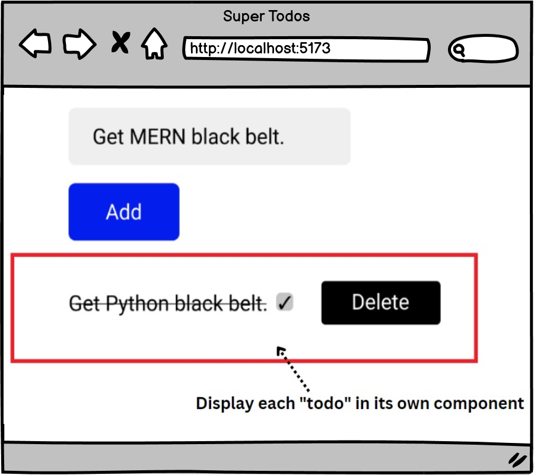

# [Super Todo List (Practice)](https://login.codingdojo.com/m/754/16735/124698)

## Learning Objectives

- Analyze and explain the reasons behind the output of code blocks using ES6 syntax, including the application of destructuring, scope, and the spread operator.
- Evaluate potential problems in code blocks and propose appropriate solutions related to ES6 concepts such as destructuring, scope, and the spread operator.

## Super Todo List:

