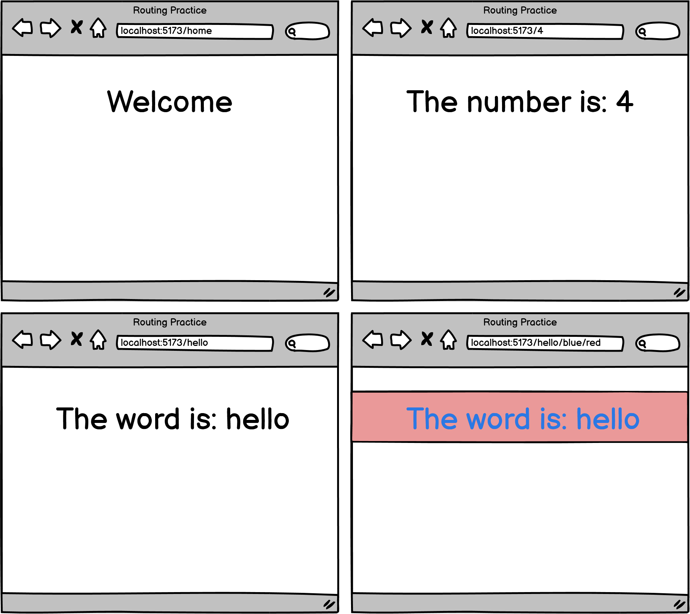

# [Routing Practice (Core)](https://login.codingdojo.com/m/754/16733/124672)

## Learning Objectives

- Develop a React app with routing for multiple components.​
- Utilize dynamic rendering techniques in React to handle route parameters and customize the displayed content accordingly.​

## Steps

Create localhost:5173/home: This should display the home page, with a generic "Welcome" heading

Create localhost:5173/4: This should display the number "4", or any other number that was sent through

Create localhost:5173/hello: This should display the word "hello" or any other word that was sent through

Create localhost:5173/hello/blue/red: This should display the word "hello" in blue text with a red background. It should work with any other valid word and colors.